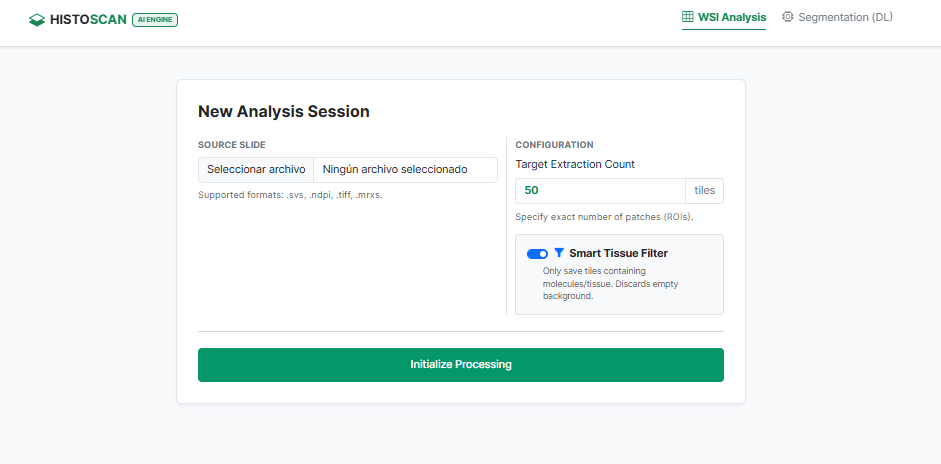
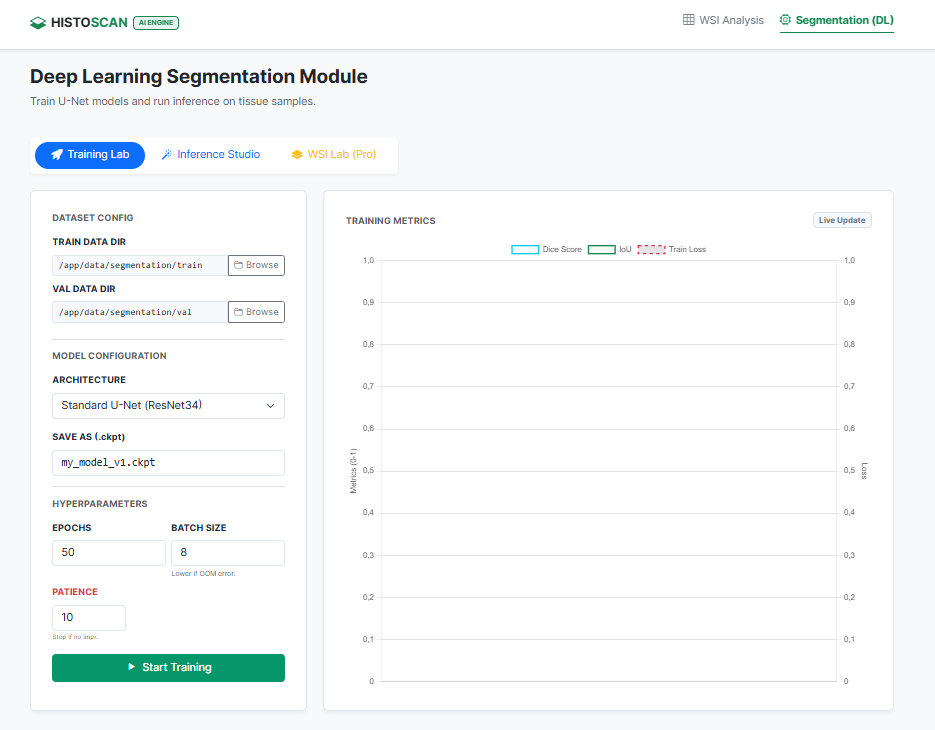
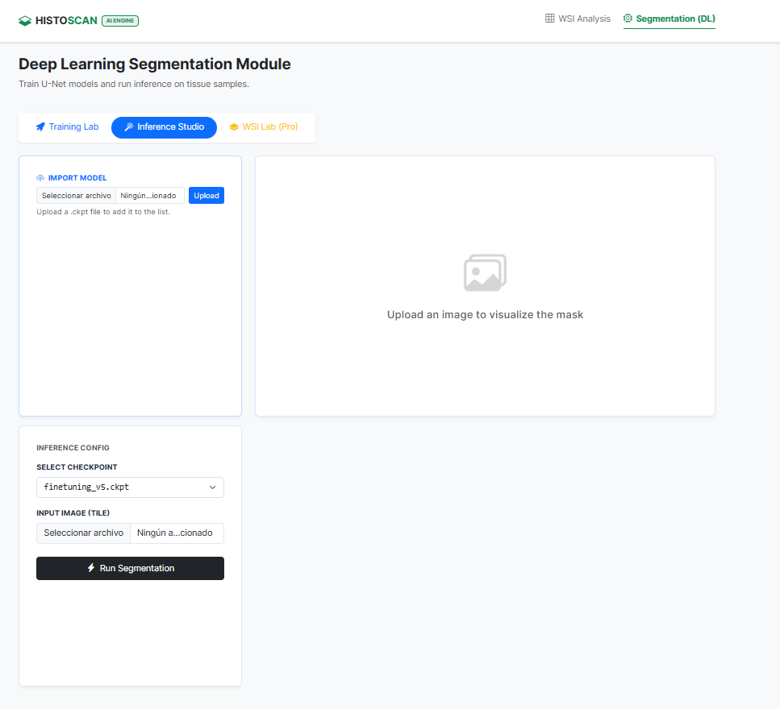
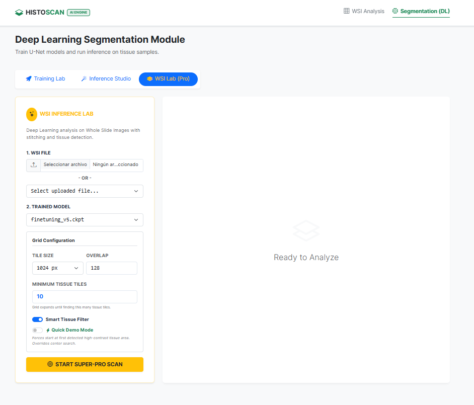

# HistoScan AI: WSI Segmentation & Analysis Engine


**HistoScan AI** is an enterprise-grade solution designed for the analysis of Whole Slide Images (WSI) in Digital Pathology. It provides a complete pipeline to handle gigapixel images efficiently using Deep Learning, overcoming memory constraints through tiling and sliding-window inference.

### Key Features
* **Module A (Tiling):** High-performance extraction of patches and Deep Zoom pyramid generation from `.tiff`/`.svs` slides.
* **Module B (Deep Learning):** * **Training:** Train U-Net architectures (ResNet encoders) with advanced augmentation, metrics visualization, and Early Stopping.
    * **Inference:** Run predictions on individual image tiles/patches.
* **Module C (WSI Inference):** "Super-Pro" sliding window inference engine with **Smart Tissue Filtering** (statistical variance detection) and full-slide stitching.

---

## 🛠️ Prerequisites

* **Docker** (Strongly recommended for reproducibility and `libopenslide` dependency management).
* **NVIDIA GPU** (Recommended for training and inference speeds).
* **Input Data:** Place your `.tiff` or `.svs` slides in the `./data` folder.

---

## 🚀 Quick Start (Docker)

The application is containerized to ensure it runs correctly on any system.

### 1. Build the Image
```bash
docker build -t histoscan-ai .
```

### 2. Run the Container
We need to mount the local data and outputs directories to persist the results.

Linux / Mac:

```bash
docker run --gpus all -p 8000:8000 -v $(pwd)/data:/app/data -v $(pwd)/outputs:/app/outputs histoscan-ai
Windows (PowerShell):
```
```bash
PowerShell
docker run --gpus all -p 8000:8000 -v ${PWD}/data:/app/data -v ${PWD}/outputs:/app/outputs histoscan-ai
```
(Note: Remove --gpus all if you are running on CPU).

### 3. Access the Web Interface

Open your browser and navigate to: http://localhost:8000

### CLI Execution Instructions
Per the technical requirements, all modules can be executed independently via Command Line Interface (CLI) inside the Docker container.

To run CLI commands, first enter the running container:

```bash
# 1. Get Container ID
docker ps
```

## Enter shell
```bash
docker exec -it <CONTAINER_ID> bash
```

# Module A: WSI Tiling & Pyramids
Generates a multi-resolution pyramid and extracts sample tiles for dataset creation.

<p align="center">  </p>

```bash
python -m wsi.wsi_tiler \
  --slide /app/data/<YOUR_SLIDE>.tiff \
  --out /app/outputs/tiling_result \
  --max-tiles 50
```

# Module B.1: Model Training
Trains a segmentation model (U-Net) using the dataset structure in data/segmentation.

<p align="center">   </p> <p align="center"><i>Left: Training loss and IoU curves. Right: Inference on a validation tile.</i></p>

```bash
python -m seg.train \
  --train_dir /app/data/segmentation/train \
  --val_dir /app/data/segmentation/val \
  --out /app/outputs/models/experiment_1 \
  --epochs 100 \
  --batch_size 4 \
  --patience 15 \
  --model unet \
  --save_name best_model.ckpt
```

Arguments:

--model: Architecture choice (unet, finetune [ResNet50], or custom [U-Net++]).

--patience: Epochs to wait without improvement before Early Stopping.

--demo: (Optional) Runs a fast sanity check (2 epochs).

# Module B.2: Single Tile Prediction
Runs inference on a single image (e.g., a .png or .jpg tile) to generate a segmentation mask.

```bash
python -m seg.predict \
  --input /app/data/segmentation/val/images/sample_01.png \
  --ckpt /app/outputs/models/experiment_1/best_model.ckpt \
  --out /app/outputs/single_predictions
```

Arguments:

--input: Path to a single image file OR a directory containing images.

--ckpt: Path to the trained model checkpoint (.ckpt).

--out: Folder where the generated masks will be saved.

# Module C: Full WSI Inference (Super-Pro)
Runs inference on a whole slide using sliding windows, filters non-tissue artifacts using statistical variance, and stitches the result.

<p align="center">  </p> <p align="center"><i>Full slide reconstruction (1024px tiles) detecting cellular tissue while ignoring background.</i></p>

```bash
python -m seg.wsi_predict \
  --slide /app/data/<YOUR_SLIDE>.tiff \
  --ckpt /app/outputs/models/experiment_1/best_model.ckpt \
  --out /app/outputs/wsi_inference \
  --num_tiles 10 \
  --tile_size 1024 \
  --overlap 64 \
  --smart_filter
```

Arguments:

--tile_size: Native resolution for processing (recommended: 1024).

--smart_filter: Enables the statistical variance detector to skip empty background tiles.

--num_tiles: Minimum number of tissue-containing tiles to extract individually.

--demo_mode: (Optional) Forces the algorithm to start at a high-contrast area for quick demonstrations.

## Project Structure
```
/app
├── web/               # FastAPI Backend & Jinja2 Templates (UI)
├── wsi/               # Tiling Module (OpenSlide logic)
├── seg/               # Deep Learning Module (Train/Predict logic)
├── data/              # Input data (Volume mounted from host)
└── outputs/           # Results (Volume mounted from host)
```
## Technical Report
For a detailed explanation of architectural decisions (e.g., why we use 1024px resolution, how the Smart Filter works, Early Stopping implementation) and performance analysis, please refer to the technical report:
